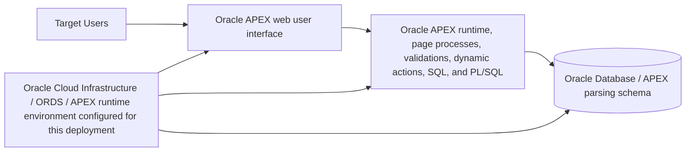

# Application Documentation

Generated at UTC: 2026-06-23T05:16:28+00:00
Source SQL: /Users/varsr/Documents/apex-cicd-pipeline/apex/f100.sql
## 1. Overview / Introduction

**Application name:** Credentials for fte  
**Application ID:** Not found

**Purpose:** Oracle APEX application generated from the deployment SQL export.

**Business problem:** Update this value with the actual business problem solved by the application.

**Target users**
- End users
- Application administrators

**Key features**
- Oracle APEX page-based user interface
- Generated page-by-page technical documentation from SQL export
- Generated architecture, user guide, API, database, and security documentation in one combined file

**Scope:** This documentation is generated from the APEX SQL file used in the deployment branch.

**Limitations**
- Only metadata present in the APEX SQL export can be extracted automatically.
- Business descriptions, screenshots, non-exported database objects, external API contracts, and infrastructure details should be maintained manually in this config file.
## 2. System Architecture

### High-level architecture diagram

### How the system works internally

The application is an Oracle APEX application generated from an APEX SQL export. Users interact with the APEX frontend through browser pages, regions, items, buttons, validations, and navigation menus. APEX runtime submits page state to backend PL/SQL processes and validations. Backend logic reads and writes Oracle Database tables through the APEX parsing schema. ORDS/APEX infrastructure handles HTTP routing, sessions, authentication, and rendering.

### Components / services

**Frontend:** Oracle APEX web user interface  
**Backend:** Oracle APEX runtime, page processes, validations, dynamic actions, SQL, and PL/SQL  
**Database:** Oracle Database / APEX parsing schema  
**Cloud / infrastructure:** Oracle Cloud Infrastructure / ORDS / APEX runtime environment configured for this deployment

**APEX pages**
Not found in SQL export.

**Regions**
- pipeline_status_region
- progress_bar_region
- topic
- chat_bot
- ai-solution-panel

**Processes**
- ASK_FAQ
- Fetch Bucket Details
- Save File and Create Job
- CLEAR_SESSION_ON_LOAD
- SAVE_SUPPORT_REQUEST
- SAVE_FEEDBACK
- Generate Random Value
- Set Username Cookie
- Login
- Clear Page(s) Cache
- Get Username Cookie

**Validations**
- Not found in SQL export.

### Component communication

1. Browser sends page requests and form submissions to APEX/ORDS.
2. APEX runtime validates session state and authorization.
3. Page processes, validations, dynamic actions, and PL/SQL logic execute in the Oracle Database context.
4. Data is queried from or written to application tables.
5. APEX renders updated HTML/JSON responses back to the browser.

### Third-party integrations
- No third-party integrations were configured. Update documentation_config.json if applicable.
## 5. User Guide

### Navigation instructions

Use the application URL for the target environment. After login, use the application navigation menu, page links, buttons, and forms exposed by the APEX UI.

**Discovered pages**
Not found in SQL export.

### Workflow examples

1. Open the APEX application URL.
2. Sign in with an authorized user.
3. Navigate to the required page from the menu.
4. Fill required fields.
5. Use safe action buttons such as Save, Apply, Create, Search, or Submit.
6. Review success or validation messages.

**Discovered buttons**
- New
- BTN_APPROVE
- Open
- BTN_REJECT
- BTN_USE_CURRENT
- BTN_AI_SOLUTION
- BTN_SUBMIT
- Example
- Clear_form
- AI_Response
- submit
- LOGIN

### Screenshots

Screenshots should be captured from Playwright reports or manually added under documentation/screenshots/.

### FAQs
| Question | Answer |
| --- | --- |
| How do I access the application? | Open the environment-specific APEX URL and sign in with an authorized account. |
| What should I do if I see an error? | Capture the page name, timestamp, screenshot, and steps taken, then contact the application administrator. |

### Troubleshooting tips
- Confirm that all mandatory fields are completed.
- Refresh the page and retry the action once.
- If the problem persists, share the page name, input values, timestamp, and screenshot with support.
## 6. API Documentation

No ORDS REST API definitions were detected in the SQL export. If APIs exist outside this export, add them manually in documentation_config.json or extend the generator.

### Endpoints
Not found in SQL export.

### Request / response examples

No concrete request/response payload examples were found in the SQL export. Add examples manually for each public or internal API endpoint.

### Authentication
Environment-specific authentication. Update this if REST/ORDS APIs are exposed.

### Error codes
- 400 Bad Request
- 401 Unauthorized
- 403 Forbidden
- 404 Not Found
- 429 Too Many Requests
- 500 Internal Server Error

### Rate limits
Not defined in the APEX SQL export. Define limits here if ORDS, API Gateway, or service-level throttling is configured.
## 7. Database Documentation

### ER diagram

```mermaid
erDiagram
  MASTER_REPORT {
    VARCHAR2 METADATA_NOT_EXTRACTED
  }
  PIPELINE_UPLOADS {
    VARCHAR2 METADATA_NOT_EXTRACTED
  }
  PIPELINE_JOBS {
    VARCHAR2 METADATA_NOT_EXTRACTED
  }
  SUPPORT_REQUESTS_LOG {
    VARCHAR2 METADATA_NOT_EXTRACTED
  }
  BUCKETS {
    VARCHAR2 METADATA_NOT_EXTRACTED
  }
  UPDATED_MASTER_DOCUMENT {
    VARCHAR2 METADATA_NOT_EXTRACTED
  }
  FAQ_DOCUMENT {
    VARCHAR2 METADATA_NOT_EXTRACTED
  }
  FAQ_DOCUMENT {
    VARCHAR2 METADATA_NOT_EXTRACTED
  }
  TOKEN_USAGE_LOG {
    VARCHAR2 METADATA_NOT_EXTRACTED
  }
  LOGS {
    VARCHAR2 METADATA_NOT_EXTRACTED
  }
  BOT {
    VARCHAR2 METADATA_NOT_EXTRACTED
  }
  YOUR {
    VARCHAR2 METADATA_NOT_EXTRACTED
  }
```

### Tables and relationships

**Tables referenced**
- master_report
- pipeline_uploads
- pipeline_jobs
- support_requests_log
- buckets
- WKSP_CHAITHRAINTERNS.UPDATED_MASTER_DOCUMENT
- WKSP_CHAITHRAINTERNS.FAQ_DOCUMENT
- FAQ_DOCUMENT
- token_usage_log
- logs
- bot
- your
- Oracle
- our
- SR
- updated_buckets
- the

**Relationships**
Not found in SQL export.

### Data dictionary
| Table | Column | Data Type | Nullable | Notes |
| --- | --- | --- | --- | --- |
| master_report | Not extracted | Not extracted | Not extracted | Table referenced in SQL export |
| pipeline_uploads | Not extracted | Not extracted | Not extracted | Table referenced in SQL export |
| pipeline_jobs | Not extracted | Not extracted | Not extracted | Table referenced in SQL export |
| support_requests_log | Not extracted | Not extracted | Not extracted | Table referenced in SQL export |
| buckets | Not extracted | Not extracted | Not extracted | Table referenced in SQL export |
| WKSP_CHAITHRAINTERNS.UPDATED_MASTER_DOCUMENT | Not extracted | Not extracted | Not extracted | Table referenced in SQL export |
| WKSP_CHAITHRAINTERNS.FAQ_DOCUMENT | Not extracted | Not extracted | Not extracted | Table referenced in SQL export |
| FAQ_DOCUMENT | Not extracted | Not extracted | Not extracted | Table referenced in SQL export |
| token_usage_log | Not extracted | Not extracted | Not extracted | Table referenced in SQL export |
| logs | Not extracted | Not extracted | Not extracted | Table referenced in SQL export |
| bot | Not extracted | Not extracted | Not extracted | Table referenced in SQL export |
| your | Not extracted | Not extracted | Not extracted | Table referenced in SQL export |
| Oracle | Not extracted | Not extracted | Not extracted | Table referenced in SQL export |
| our | Not extracted | Not extracted | Not extracted | Table referenced in SQL export |
| SR | Not extracted | Not extracted | Not extracted | Table referenced in SQL export |
| updated_buckets | Not extracted | Not extracted | Not extracted | Table referenced in SQL export |
| the | Not extracted | Not extracted | Not extracted | Table referenced in SQL export |

### Stored procedures / functions / packages
- Not found in SQL export.

### Indexing strategy

The following indexes were extracted from SQL DDL. Review execution plans and add missing indexes for foreign keys, search columns, and high-volume reporting pages.

Not found in SQL export.
## 8. Security Documentation

### Authentication method
Use the extracted APEX authentication scheme when present. Update this if SSO, custom authentication, or environment-specific login is used.

**Detected authentication schemes**
- No authentication scheme name found in SQL export.

### Authorization roles / schemes
- No authorization roles/schemes were found. Define roles in documentation_config.json if they are managed externally.

### Encryption details
Use HTTPS/TLS in transit. Database encryption depends on the configured Oracle Database/OCI environment.

### Audit logging
Review APEX activity logs, custom audit tables, and database auditing configuration.

### Security best practices
- Store secrets only in Jenkins credentials or OCI Vault, never in source control.
- Apply authorization schemes to sensitive pages, buttons, processes, and APIs.
- Validate input server-side and avoid leaking ORA-/ERR- details to end users.
- Use least privilege for database schemas and service users.
- Review audit logs for authentication, authorization, data changes, and administrative actions.

### Security review checklist
- Confirm every sensitive page has authorization checks.
- Confirm server-side validations exist for critical fields.
- Confirm destructive buttons require explicit authorization and confirmation.
- Confirm no credentials, API keys, wallet files, or passwords are committed.
- Confirm Jenkins credentials are masked and bound only for required stages.
- Confirm application errors do not leak ORA-/ERR- details to end users.